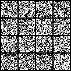
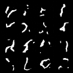
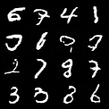

项目简介

用轻量级 DDPM 在 MNIST 上实现扩散模型生成。

技术点
forward diffusion
reverse denoising
noise prediction objective
sinusoidal time embedding
lightweight UNet
实验过程

你可以很真实地写出这条学习轨迹：

第一版：训练后只能生成噪声
第二版：降低学习率后训练稳定，但只能生成笔画碎片
第三版：升级 time embedding 和 UNet 后，开始生成可辨认数字

这会让项目非常有“研究迭代感”。

结果图

## Results

### Training Evolution

| Version 1 (Noise)          | Version 2 (Structure)      | Version 3 (Final)          |
|----------------------------|----------------------------|----------------------------|
|  |  |  |

